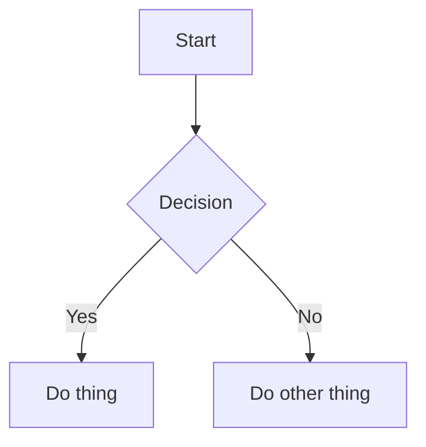

# MermaidJS Diagrams Skill

Generate MermaidJS diagrams as fenced code blocks in Markdown. Diagrams render natively in GitHub, VS Code, Obsidian, and most modern Markdown viewers — no external tooling required.

## Supported Diagram Types

| Type | MermaidJS syntax | Use case |
|------|-----------------|----------|
| Flowchart | `flowchart TD` | Logic flows, decision trees, process maps |
| Sequence diagram | `sequenceDiagram` | API calls, service interactions, message flows |
| Class diagram | `classDiagram` | Domain models, OOP structures |
| Entity-relationship | `erDiagram` | Database schemas |
| State diagram | `stateDiagram-v2` | State machines, lifecycles |
| C4 context | `C4Context` | System architecture overviews |

For syntax examples and common patterns for each type, see `references/diagram-types.md`.

## Workflow

### 1. Understand the Diagram

Ask **one question at a time** to clarify what to draw. Do not ask multiple questions at once.

If the user's request is already specific enough (e.g. "sequence diagram of the login flow between client, API, and database"), skip clarification and generate immediately.

Focus on:
- **What is being shown** — process, system, data model, state machine?
- **Who the actors/components are** — services, classes, entities, states?
- **Key relationships or steps** — what connects to what, in what order?

### 2. Choose the Right Diagram Type

Select the most appropriate type based on what the user wants to show:

- **Flowchart** — when there are decisions, branches, or sequential steps
- **Sequence** — when timing and order of messages between actors matters
- **Class** — when showing attributes, methods, and inheritance relationships
- **ER** — when showing database tables and their relationships
- **State** — when an entity moves through distinct states based on events
- **C4 Context** — when showing a system and its external dependencies at a high level

If the user specifies a type, use that type. If it would not render well, offer a better alternative with a brief explanation.

### 3. Generate the Diagram

Produce the Mermaid code block. Follow the validation checklist before presenting:

**Validation checklist:**
- [ ] All arrows use correct syntax for the type (`-->`, `->>`, `-->|label|`, etc.)
- [ ] All node/participant names are defined before use
- [ ] Brackets and quotes are balanced and closed
- [ ] No reserved keywords used as unquoted node labels
- [ ] Direction specified for flowcharts (`TD`, `LR`, `BT`, `RL`)
- [ ] Labels on edges are quoted if they contain spaces or special characters

Present the diagram inline in the conversation as a fenced code block:

````markdown

````

Then ask: "Does this look right? I can adjust the layout, add more detail, or embed this in a file."

### 4. Embed or Save (Confirmation Required)

If the user wants the diagram saved, offer two options:

| Option | Action |
|--------|--------|
| **Embed in existing file** | Insert the fenced block at an appropriate location in the file |
| **Create new file** | Write to `docs/diagrams/<topic>.md` with a short heading |

**Write operations require explicit confirmation:**

| Operation | Confirmation prompt |
|-----------|-------------------|
| Embed in existing file | "Embed this diagram in `<file path>`?" |
| Create new diagram file | "Write this to `docs/diagrams/<topic>.md`?" |

Only proceed after the user confirms.

## Integration with Brainstorming Skill

When the Brainstorming skill produces a spec in `docs/specs/`, offer to generate diagrams for:
- Architecture sections → C4 context or flowchart
- Data model sections → ER diagram or class diagram
- Interaction flows → sequence diagram
- State lifecycle sections → state diagram

Example offer:
> "The spec covers a request flow between three services — want me to add a sequence diagram for that section?"

## Error Handling

**Diagram does not render (syntax error):** Re-read the validation checklist, correct the specific issue, and present the fixed version.

**User says layout is wrong:** MermaidJS supports multiple direction keywords (`TD`, `LR`, `BT`, `RL`) for flowcharts and `direction` for other types. Try an alternative and present it.

**Diagram is too large to read:** Break it into multiple smaller diagrams focused on sub-systems, or use subgraphs to group related nodes.

**C4 diagrams require `@C4Context` macros:** If the viewer does not support C4, offer a standard flowchart as a fallback.

## Additional Resources

For diagram type syntax, common patterns, and examples, see `references/diagram-types.md`.
